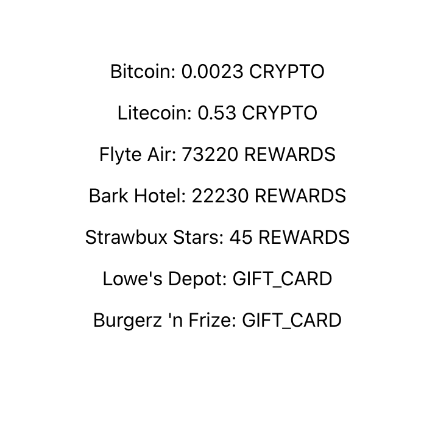

# Micro Wallet Web

## About the Repo

This is a React.js technical challenge. It's a very simple, bootstrapped React app and lightweight (fake) back-end. This app is meant to approximate what the real app is like (in tech stack, code, and functionality), but it's boiled down to only the essentials.

It uses:

1. Typescript
1. React.js
1. Create React App
1. react-router-dom
1. [json-graphql-server](https://github.com/marmelab/json-graphql-server) for the back-end, database, and GraphQL
1. [Apollo Client](https://www.apollographql.com/docs/react/) (React client for GraphQL requests)

## Getting Started

1. [Import this repo to your Github account](https://github.com/new/import) **IMPORTANT: Select "Private", not "Public"**
1. Clone your repo locally and `cd` into it
1. Run `yarn` or `npm i`
1. Open a couple of terminal windows.
   1. In the first, run `yarn serve`. This runs the back-end server, which generates routes and mutations from `db.js`.
   1. In the second, run `yarn start`. Your app will load up at http://localhost:3000.
1. You should now be presented with a very basic app with a portfolio of some holdings of various types.
1. Open the GraphiQL environment for your local server: http://localhost:3005/graphql. You can try queries against the back-end here, with autocomplete. Use this as the source of all back-end data.

## The Challenge

This challenge is intended to take about one hour.

1. Improve the portfolio page:
   1. Display all holdings BY CATEGORY, such that each category has its respective holdings' information displayed nicely.
   1. Format all numbers and strings appropriately (denominations, currency symbols, thousands delineation, etc)
   1. Add a pie chart of the holdings
   1. Add refresh button for updated holdings on the Portfolio page

## What’s important

We will evaluate your submission on:

1. Fulfillment of requirements and functionality (as limited by time taken)
1. Code quality (is this code mergeable as-is, or would the PR be rejected?)
1. Usable UI & navigation (no need for high polish)

## Final Product

Push up your repo/branch to Github and give **read** access to the users provided by your recruiter.

In this README (below), please include:

- Your goal and primary focus
- The amount of time you took
- Any assumptions and/or constraints you came up with while working through this challenge
- What you would change or add if you had more time
- A screen recording or screenshots of your app

---
